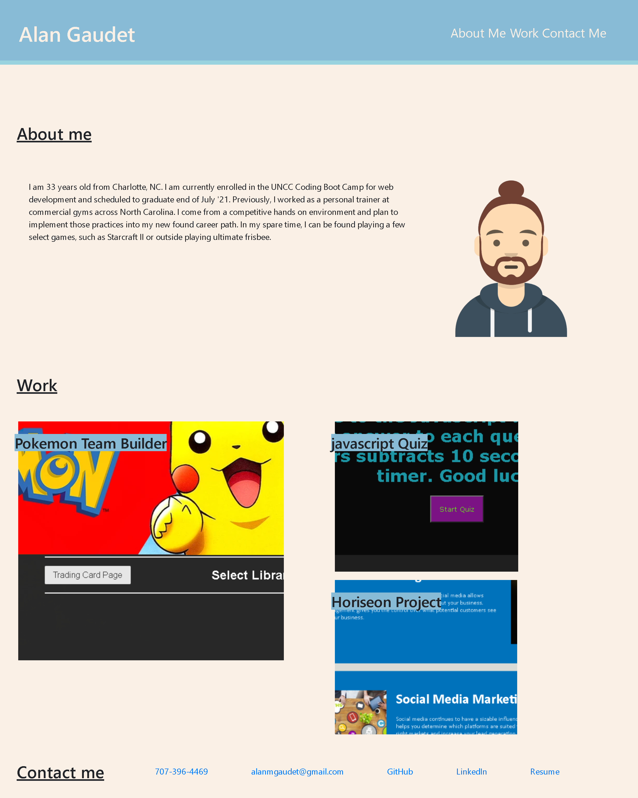

# alan-gaudet-portfolio
## Contents
1. [About](#About)
2. [Description](#Description)
3. [Screenshot](#Screenshot)
3. [License](#License)
4. [Contact-Info](#Contact-Info)

## About
Set up a virtual portfolio for myslelf for potential employers to view. Set up with working navigation bar to each three sections, About me, Work, and Contacts info. The work section includes images with active links to deployed projects. Bottom contacts list phone number, email, and direct link to github portfolio,

## Description

* Added dynamic layout for viewing across different media

* Included recent photo of myself.

* Improved layout for easy viewing in natural line of sight view

* Contact links are all live links for phone, email, and link to github

* Work section images are a direct link to the deployed project their are previewing

## Screenshot

## Contact-Info

Alan Gaudet - <alanmgaudet@gmail.com>

Portfolio - <https://github.com/amgaudet>

## License
MIT License

Copyright (c) 2021 Alan Gaudet

Permission is hereby granted, free of charge, to any person obtaining a copy
of this software and associated documentation files (the "Software"), to deal
in the Software without restriction, including without limitation the rights
to use, copy, modify, merge, publish, distribute, sublicense, and/or sell
copies of the Software, and to permit persons to whom the Software is
furnished to do so, subject to the following conditions:

The above copyright notice and this permission notice shall be included in all
copies or substantial portions of the Software.

THE SOFTWARE IS PROVIDED "AS IS", WITHOUT WARRANTY OF ANY KIND, EXPRESS OR
IMPLIED, INCLUDING BUT NOT LIMITED TO THE WARRANTIES OF MERCHANTABILITY,
FITNESS FOR A PARTICULAR PURPOSE AND NONINFRINGEMENT. IN NO EVENT SHALL THE
AUTHORS OR COPYRIGHT HOLDERS BE LIABLE FOR ANY CLAIM, DAMAGES OR OTHER
LIABILITY, WHETHER IN AN ACTION OF CONTRACT, TORT OR OTHERWISE, ARISING FROM,
OUT OF OR IN CONNECTION WITH THE SOFTWARE OR THE USE OR OTHER DEALINGS IN THE
SOFTWARE.